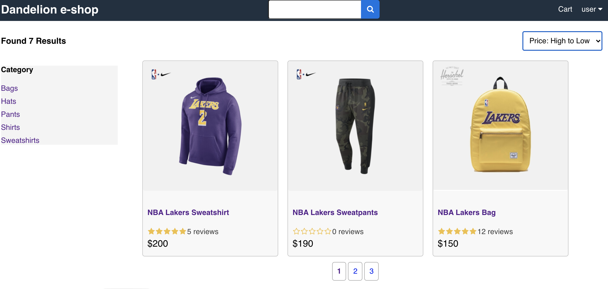
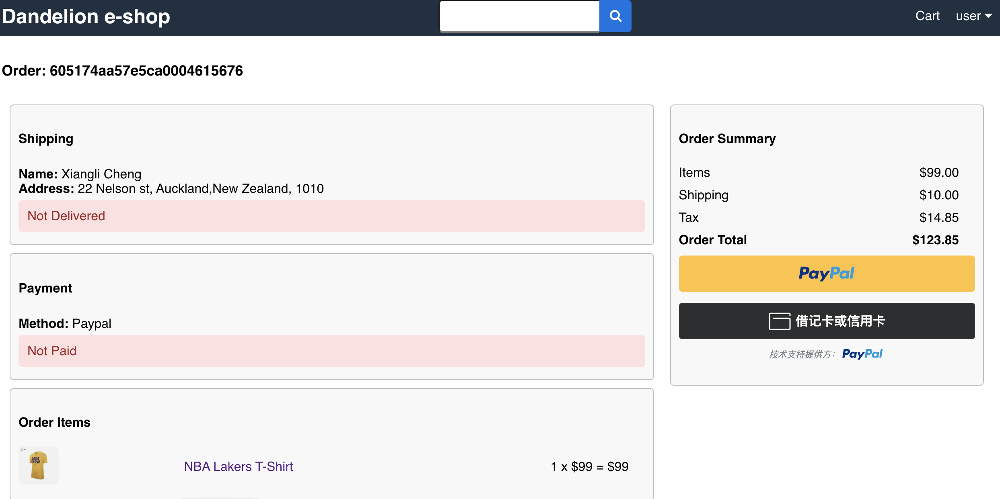

# Dandelion e-Commerce App

This full-stack JavaScript project implements a functional e-commerce application. The front end is based on the React, Redux and CSS technologies, the back end uses the Node.js, Express and MongoDB service. It also utilizes the PayPal api as a payment method.

<em>Using Bootstrap to replace CSS is still in progress.</em>

Demo URL: https://dandelion-ecommerce-app.herokuapp.com/

## What is it built on

The backend is built using Node.Js, Express, MongoDB and JSON Web Token.
The frontend is built on Javascript, React, Redux, axios, CSS and Bootstrap.

## How do you run or recode it locally

### Backend

In the root directory, you need to run:

```
npm install
npm start
```

### Frontend

In the 'client' directory, you also need to run:

```
npm install
npm start
```

Afrer that, open a new browser to run

<http://localhost:3000/>

When complete, the app will look similar to that shown in the following screenshots:




